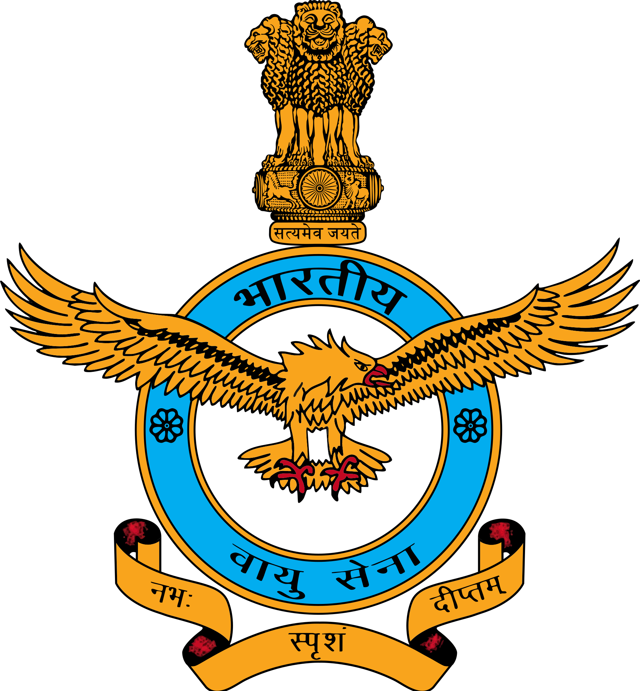
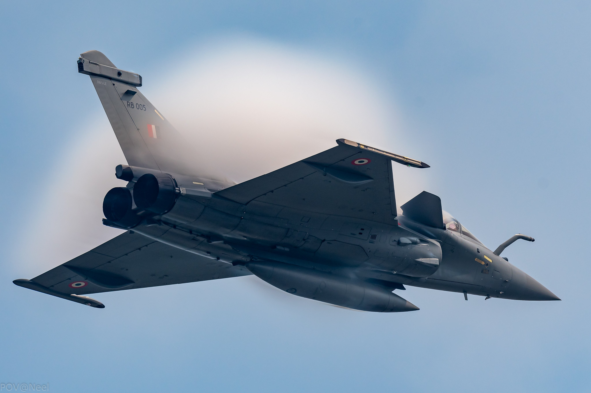
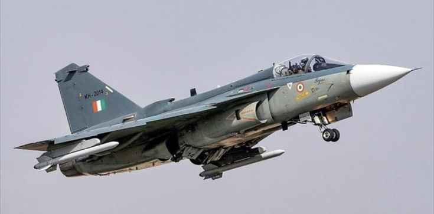
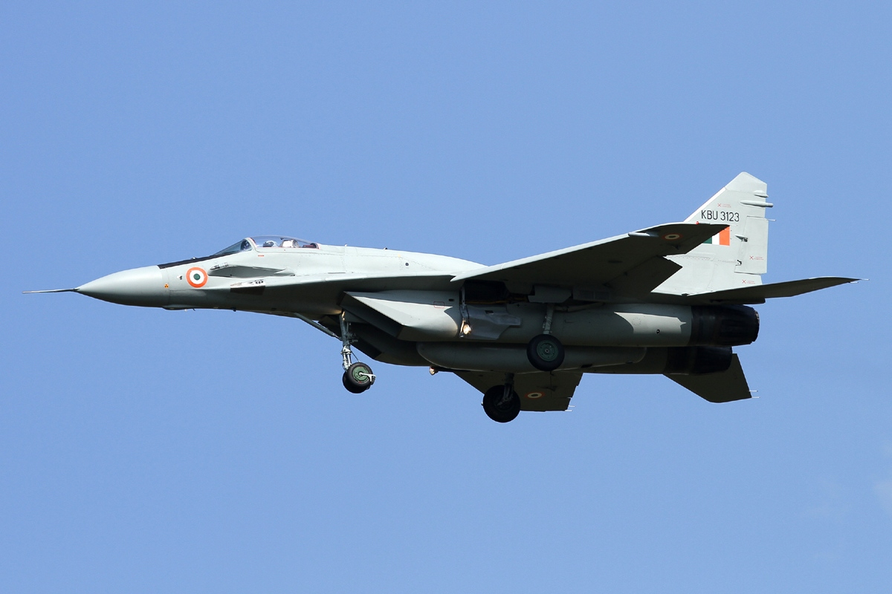
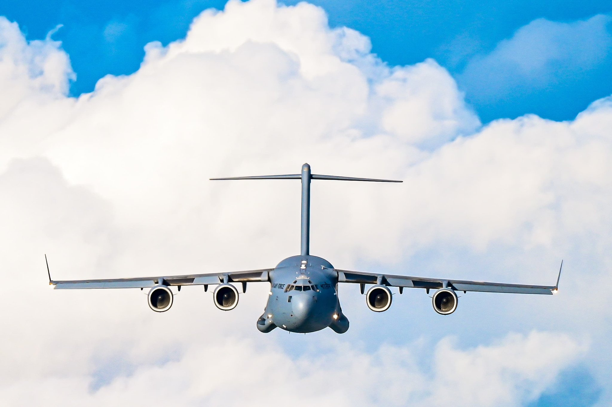

  

  # 🇮🇳 Touch the Sky with Glory
  ### 94th Indian Air Force Day Commemorative Digital Tribute
  **नभः स्पृशं दीप्तम् • 8 October 2026**

  

    
    
    
    
  

  

    <b>A high-performance aerospace digital tribute honoring the valor, technological supremacy, and supreme sacrifice of the Indian Air Force.</b>
  

  ---

  

    <a href="https://indianairforce-sky.vercel.app"><b>🚀 Click Here to Open the Live Website</b></a>
  

---

## 📖 The Story Behind This Project

> *"Every year on October 8th, the skies over India roar with pride as the Indian Air Force celebrates its anniversary since its inception in 1932. As a software developer and proud citizen, I wanted to build something far beyond a standard template — an authentic, high-octane aerospace experience that brings the roar of afterburners, the precision of combat aviation, and the sacred memory of our martyrs directly to every screen."*

I engineered this project as a tribute to the men and women who safeguard 1.4 billion citizens across 7 operational commands. From the delta-wing agility of the **Dassault Rafale** and indigenous **HAL Tejas**, to the eternal flame at the **National War Memorial**, this website captures the spirit of **"Touch the Sky with Glory" (नभः स्पृशं दीप्तम्)**.

---

## 🔗 Live Interactive Experience

| Platform | Direct URL |
|---|---|
| **Live Showcase** | [https://indianairforce-sky.vercel.app](https://indianairforce-sky.vercel.app) |
| **Best Viewed On** | 📱 Rotate phone to **Landscape Mode** for panoramic Cockpit View, or any desktop browser |
| **Hosting** | Deployed on **Vercel Global Edge Network** (Mumbai `bom1` Node, sub-40ms latency) |

---

## ✈️ Visual Showcase

  <table>
    <tr>
      <td width="50%" align="center">
        
         
        <b>Dassault Rafale — 4.5+ Gen Omnirole Fighter</b>
      </td>
      <td width="50%" align="center">
        
         
        <b>HAL Tejas Mk1 — Indigenous Supersonic Fighter</b>
      </td>
    </tr>
    <tr>
      <td width="50%" align="center">
        
         
        <b>MiG-29UPG — Air Superiority Interceptor</b>
      </td>
      <td width="50%" align="center">
        
         
        <b>C-17 Globemaster III — Strategic Heavy Airlift</b>
      </td>
    </tr>
  </table>

---

## ⚡ Core Interactive Features

* **🚀 Supersonic Airshow Flypast Engine**:
  * Simulates precision formation flypasts (Trishul, Vic, Delta Lead) featuring authentic Sukhoi Su-30MKI, Rafale, and Tejas SVG interceptors.
  * Emits dynamic tricolor billowing vapor trails (Saffron, White, and India Green).
  * Synthesizes realistic supersonic jet engine Doppler roar using the native Web Audio API.

* **⏱️ Tactical 24-Hour Military Telemetry**:
  * Live Indian Standard Military Time (`HH:mm:ss HRS IST`) integrated into the header.
  * Memoized non-jitter countdown clock ticking toward 8 October 2026.
  * Fluid zoom in / zoom out controls (`80%` to `130%`).

* **🌸 Pushpa Varsha (Ceremonial Helicopter Flower Shower)**:
  * Traditional parade protocol where Mi-17 and ALH Dhruv helicopters drop rose and marigold petals over the grounds.
  * Features 42 GPU-accelerated flower petals falling with harmonic chime audio.

* **🛡️ Combat Fleet Arsenal & Telemetry**:
  * High-resolution photographs and specifications for 12 IAF aircraft (Rafale, Su-30MKI, Tejas Mk1/Mk2, Mirage 2000, Jaguar, C-17, C-130J, Apache, Chinook, Prachand).
  * Interactive modal spec sheets detailing max velocity, combat range, service ceiling, and weapon payloads.

* **🕯️ Amar Jawan Memorial (Cloud Homage Counter)**:
  * Persistent citizen tribute counter powered by CountAPI cloud endpoints honoring Param Vir Chakra heroes (Flying Officer Nirmal Jit Singh Sekhon, Marshal of the IAF Arjan Singh).

* **📺 Official Live Broadcast & Telecast Guide**:
  * Instant access to DD National HD, Official IAF YouTube channel (`@IndianAirForce_mcc`), and official X handle (`@IAF_MCC`).

* **📱 Mobile Landscape Cockpit Mode**:
  * Smart viewport intelligence: Rotating any smartphone horizontally transforms the interface into a wide-screen panoramic cockpit view.

---

## 🛠️ Technology Stack

| Layer | Technologies |
|---|---|
| **Framework** | **Next.js 16** (App Router, Turbopack, 100% Static HTML/CSS/JS export) |
| **UI & Styling** | **React 19**, **Tailwind CSS v4**, **Lucide React**, Watermelon UI design tokens |
| **Physics & Animations** | **Motion (Framer Motion)** with 60fps GPU hardware acceleration (`translate3d`) |
| **Audio Engine** | Native **Web Audio API (`AudioContext`)** pink-noise & harmonic chime synthesizer |
| **Data & Cloud** | **CountAPI** for persistent homage counter + local storage fallback |
| **SEO & Discovery** | Schema.org JSON-LD structured data, dynamic OpenGraph meta tags, `sitemap.xml`, `robots.txt` |
| **Edge Hosting** | **Vercel Global Edge CDN** (sub-40ms response in India) |

---

## 🎖️ Param Vir Chakra Citation

> *"Flying Officer Nirmal Jit Singh Sekhon was awarded the Param Vir Chakra (posthumous) for sublime heroism during the 1971 War. Flying a Folland Gnat over Srinagar Airfield under direct attack by six enemy Sabre jets, he engaged the entire enemy formation single-handedly, scoring decisive hits before making the supreme sacrifice."*

---

## 📜 Disclaimer

This project is an independent personal digital tribute created for educational, portfolio, and national commemorative purposes. It is non-official and non-commercial. All official emblems, citations, and aircraft photography belong to their respective copyright holders.

---

  
<b>Made with reverence and devotion for the Indian Armed Forces 🇮🇳</b>

  
<b>JAI HIND! VANDEMATARAM!</b>

